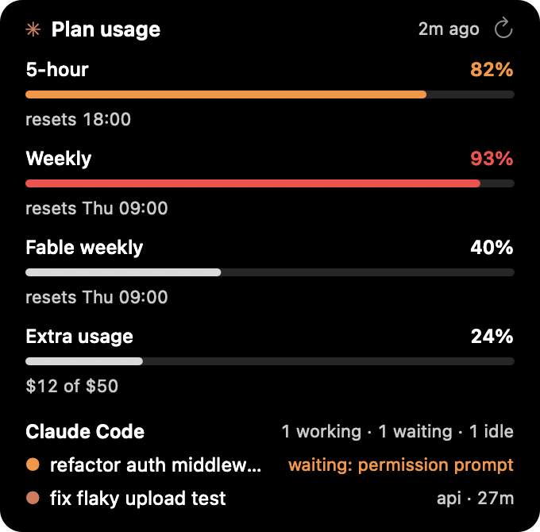
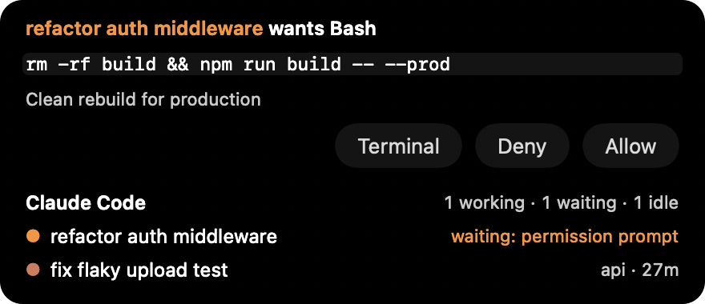

# ccusagebar

Your Claude plan limits, always on the MacBook Pro Touch Bar, or around the
notch on MacBooks that have one instead.


The same numbers Claude Code's `/usage` shows: the 5-hour session limit, the
weekly limit, and any per-model weekly limit (Fable, today). The line takes the
app area of the Touch Bar; brightness and volume stay in the Control Strip. The
system ✕ can close it; it comes back on the next app switch, or tap ✦ in the
Control Strip.

It covers the Touch Bar's Esc, so it suits Macs with a physical Esc key (or an
external keyboard).

A limit turns amber at 75% and red at 90% (or sooner, if the usage API itself
calls it high). Extra usage shows in the line while it is switched on, and a
credit grant once you start spending it.

## Details



Tap the Touch Bar line, or click the notch, and the details drop from the top of
the screen: every limit with a bar and how long until it resets, extra usage and
credits, and the Claude Code sessions running on this Mac, the ones waiting on
you (a permission prompt, a question) first. ↻ refreshes; a click anywhere else
puts it away.

## Sessions

With a Claude Code session working, the notch's left ear shows it: its name and how
long it has been at it, behind a ✳ that breathes while Claude works and turns
orange when the session waits on you. The limits move to the right ear. In the
details, click a session to bring its terminal forward (Warp, iTerm2, Terminal,
VS Code: whichever app it runs under).

## Answering from the notch

```sh
./install-hook.sh           # after ./install.sh; ./install-hook.sh remove to undo
```



adds a `PermissionRequest` hook to `~/.claude/settings.json` (the old file is kept
as `settings.json.bak-ccusagebar`). Then, when a session needs you, the notch opens
on it, with a sound:

- a tool to allow: the command, the edit as a diff, the URL; **Allow** or **Deny**
- a question (`AskUserQuestion`): click an option, tick several, or type your own
- a plan (`ExitPlanMode`): rendered; **Approve**, or **Keep planning** with what to change

**Terminal** hands it back to the terminal and brings that forward. While the app
is not running the hook prints nothing and Claude Code asks in the terminal as
before; a prompt left for an hour goes back to the terminal too.

## Alerts

A notification when a limit reaches 80% and again at 95%, once per window, and
one when that window resets. macOS asks for permission the first time. To change
the thresholds, or turn them off:

```sh
defaults write com.hikvineh.ccusagebar alerts -array 70 90   # other thresholds
defaults write com.hikvineh.ccusagebar alerts -array         # no alerts
```

## Notch


On a MacBook with a notch the same app puts the short label in black "ears" on
either side of it: `✳ 5h 41%` on the left, `wk 11% · F 14%` on the right, and
an orange `● 1` when a Claude Code session is waiting on you. Hover to drop the
full line with reset times below the notch; click to grow it into the details. It
follows the built-in display, and hides while the lid is closed. The ears cover a
little menu bar next to the notch.

The notch line is newer than the Touch Bar one. If it sits wrong on your Mac,
[open an issue](https://github.com/HikvIneH/ccusagebar/issues/new/choose) with a
screenshot and the model.

## Choosing one

By default it shows whichever the Mac has: the Touch Bar line on a Touch Bar Mac,
the notch line on a screen with a notch, and nothing where there is neither. To
pick one yourself:

```sh
defaults write com.hikvineh.ccusagebar mode notch      # or: touchbar
defaults delete com.hikvineh.ccusagebar mode           # back to automatic
```

then quit and reopen `CCUsageBar`. `mode notch` on a screen without a notch puts
the same line in the middle of the menu bar.

## Why not MTMR / BetterTouchTool?

MTMR does this kind of thing, but its last release isn't notarized, so current
macOS blocks it. BetterTouchTool is paid. A binary you compile yourself is never
quarantined, so Gatekeeper stays out of the way.

## Install

Needs a Mac with a Touch Bar or a notch, Xcode command line tools, Node, and
Claude Code logged in with a Claude subscription:

```sh
./install.sh      # builds, copies to ~/Applications, adds a login item
```

Uninstall: quit `CCUsageBar`, delete `~/Applications/CCUsageBar.app`, and remove it
from System Settings → General → Login Items.

## How it works

- `ccusage-line.sh` reads Claude Code's OAuth token from the Keychain and calls
  the usage endpoint Claude Code itself uses (`/api/oauth/usage`). That endpoint
  rate-limits hard, so the answer is cached in `~/Library/Caches/ccusagebar.json`,
  fetched at most every 5 minutes, and shown as `(stale)` if a fetch fails. It
  prints two lines for people and a third, JSON, for the app.
- `main.swift` presents a system-modal Touch Bar through the private
  `NSTouchBar presentSystemModalTouchBar:placement:systemTrayItemIdentifier:` and
  anchors it on a Control Strip item (`DFRElementSetControlStripPresenceForIdentifier`),
  the same private calls MTMR and Pock use. It re-presents itself on every app
  switch and refreshes every 5 minutes.
- `notch.swift` is a borderless panel above the menu bar, sized from
  `NSScreen.auxiliaryTopLeftArea` / `auxiliaryTopRightArea`. Public API only.
- `details.swift` is the panel that drops below it; `alerts.swift` posts through
  `UNUserNotificationCenter`.
- `usage.swift` reads the Claude Code sessions from `~/.claude/sessions`, one file
  per running `claude`, every 3 seconds. Local files, no network.
- `bridge.swift`: the hook runs the app's own binary as `CCUsageBar --hook`, which
  passes the request over a Unix socket (`~/Library/Caches/ccusagebar.sock`, this
  user only) to the running app and prints its answer. Esc in the session kills the
  hook, which closes the socket, which takes the card away. `prompt.swift` draws
  the cards.
- It's an `LSUIElement` agent: no Dock icon, no menu bar.

Undocumented endpoint, private APIs and Claude Code's internal session files: no
App Store, and any of them could break.

Unofficial: not made by, endorsed by or affiliated with Anthropic. Not related to
the [ccusage](https://github.com/ccusage/ccusage) project either; the "cc" is for
Claude Code.

## Contributing

See [CONTRIBUTING.md](CONTRIBUTING.md): how to build, what to check, commit format.

## License

MIT
